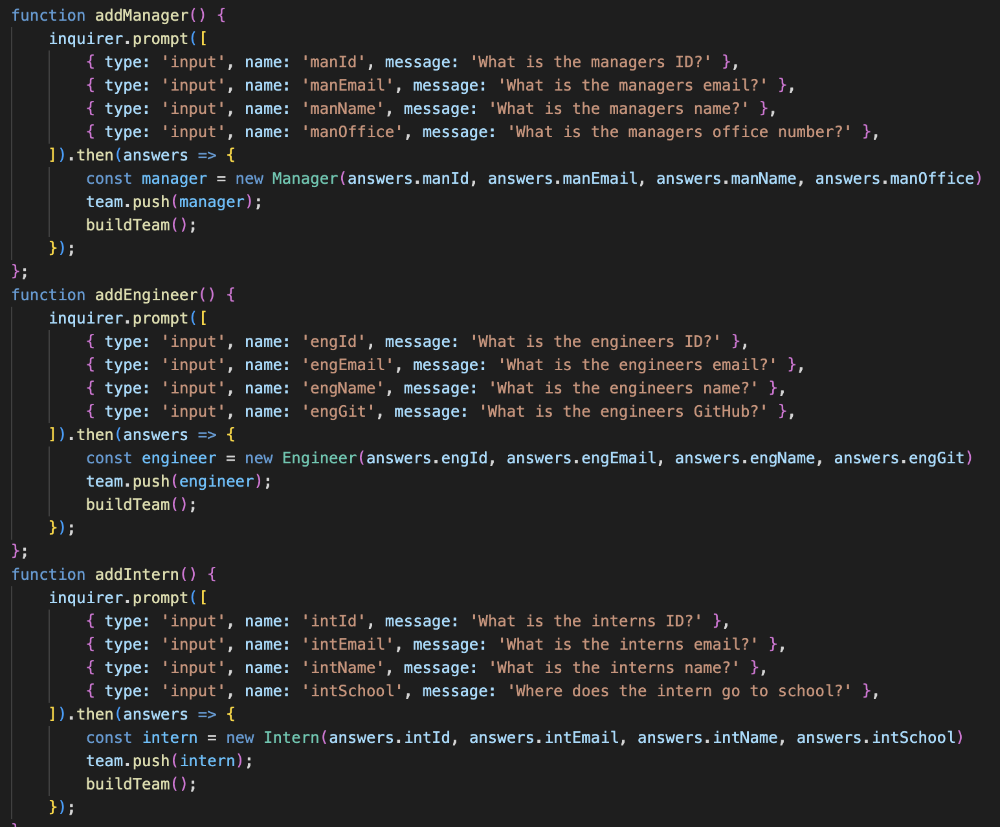
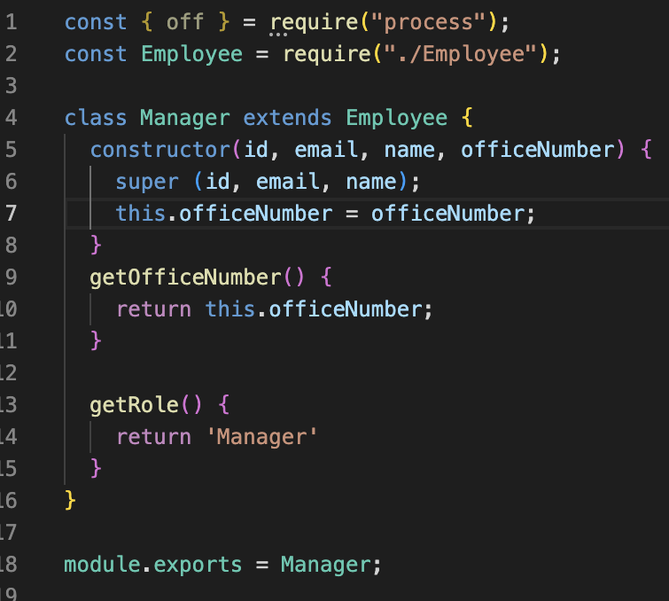
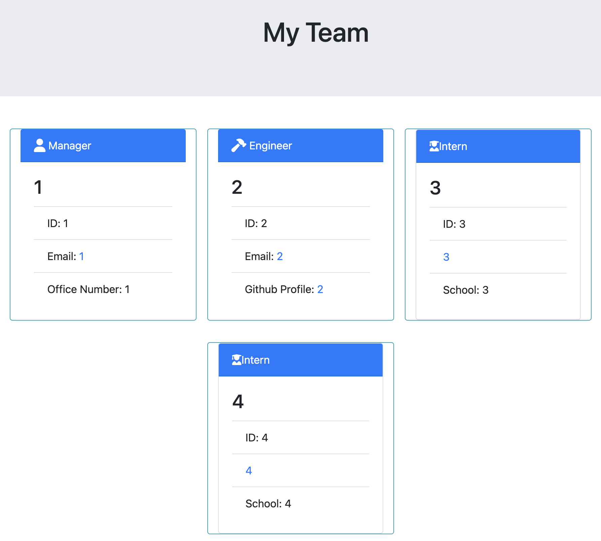

# Team Profile Generator 

## Table of Contents
1. [Description](#description)
2. [Visuals](#visuals)
3. [Installation](#installation)

## Description
This assignment was created to create a profile of your team and generate a well formed HTML page covering each individual and kept track of data pertaining to each specific individual. The project uses inquirer to fill in the data, and then that data is recorded briefly, and when you are done filling out all user information, is inserted into a well-formatted HTML document. The document uses bootstrap to keep it clean. Along with these requirements, we also had to create test cases for each individual to make sure that the data that was being inserted was correct. Once all the test cases were set up and they all passed, I knew everything would work properly. This lead me to fix a bug that I was very confused over why it was happening. 

## Visuals

These three blocks of code were essential to making each model and getting the info from each of them using the inquirer node module.

This photo shows the manager model, and what requirements it needed to fulfill that position.

Although just a sample HTML page only using numbers, this shows the output of the employees on the team, also showing the capabilities of overflow with organization for bigger teams.

## Installation
To run this program, you must clone the repo, and then in the console install all the npm dependencies. Then type npm run test to check the test cases, and then node index.js to run the program. The final HTML page is put into a folder called output. If you want to run the test cases, run npm run test in the console.
